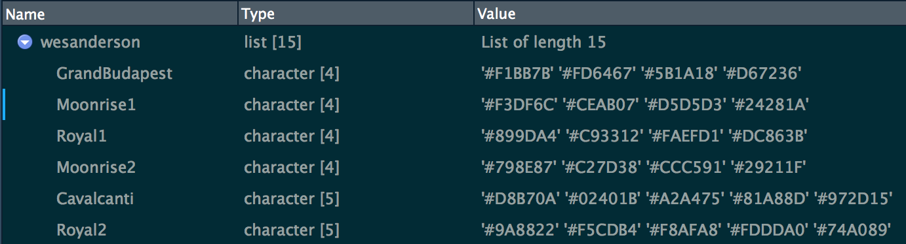

```{r, include = FALSE}
knitr::opts_chunk$set(
  collapse = TRUE,
  comment = "#>"
)
```

```{r setup}
library(repurrrsive)
```

`wesanderson` is the simplest list in repurrrsive, containing color palettes, from the [wesanderson package](https://cran.r-project.org/package=wesanderson).
Here's a glimpse: one component per palette, each containing a character vector of hex colors. *Screenshot is of RStudio's [Object Explorer](https://www.rstudio.com/blog/rstudio-v1-1-preview-object-explorer/), i.e. from calling `View(wesanderson)`.*

```{r}
#| echo: false

```

```{r}
library(purrr)

wesanderson[1:3]
```

Use `wesanderson` to demonstrate mapping functions over a list.

```{r}
map_chr(wesanderson, 1)
map_int(wesanderson, length)
map_chr(wesanderson[7:9], paste, collapse = ", ")
```

The same `wesanderson` data is also present as JSON and XML files.
Accessor functions provide the local file path.

```{r}
wesanderson_json()
wesanderson_xml()
```

Practice bringing data from JSON into an R list.

```{r}
library(jsonlite)

json <- fromJSON(wesanderson_json())
json$wesanderson[1:3]
identical(wesanderson, json$wesanderson)
```

Practice bringing data into R from XML.
You can get it into an R list with `xml2::as_list()`, but to get a list as nice as those above? That requires a bit more work.
Such is XML life.

```{r}
library(xml2)

xml <- read_xml(wesanderson_xml())
xml_child(xml)
as_list(xml_child(xml))
```
